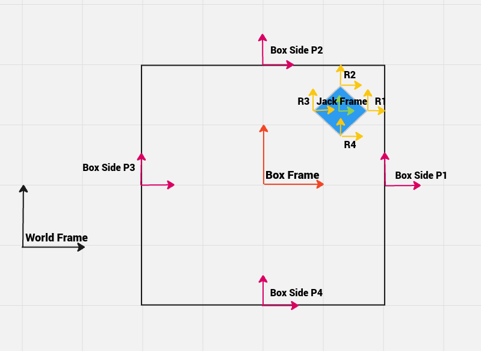

# Jack in a Box Simulation 
Author: Pushkar Dave
## Frames and Transformations
The image below depicts the frames used for modeling the dynamics of the system. There are in total **11** frames, the `World` frame, the `Box` frame at the box's geometrical center and the `Jack` frame at the jack's geometrical center. To accurately check for impacts, there are **8** additional frames, **4** for each corner of the Jack, labelled `r1` through `r4` and **4** for each side of the box (located at the center of each side), labelled  `p1` through `p4`.

The configuration of the system is represented using **6** configuration variables `xBox, yBox, thBox, xJack, yJack, thJack`.  The variables `xBox, yBox, thBox` represent the pose of the box with respect to the *world* frame and the variables `xJack, yJack, thJack` represent the pose of the jack with respect to the *box* frame.

The Euler Lagrange equations are used to solve for the equations of motion of the system. The impacts are modeled using impact update equations, which calculate the state of the system post impact.

A detailed article walking through the equations and steps will be up on my website soon. 
## Simulation Video

